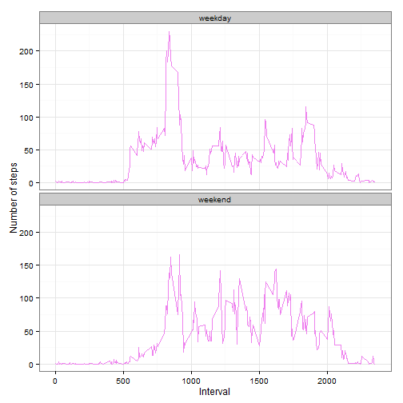

#Reproducible Research: Peer Assessment 1

####Courtesy  
sefakilic@github  
Amit Upadhyay@RPubs  
http://rstudio-pubs-static.s3.amazonaws.com/19424_092bcbaab3ee4aa6b470e9a2c3c66ee3.html  
sragh@github

###Loading and preprocessing the data


```r
library(knitr)
library(data.table)
library(ggplot2)

opts_chunk$set(echo = TRUE, results = 'hold')
        
act <- read.csv('activity.csv', header = TRUE, sep = ",",
                  colClasses=c("numeric", "character", "numeric"))
act$date <- as.Date(act$date, format = "%Y-%m-%d")
act$interval <- as.factor(act$interval)
str(act)
```

```
## 'data.frame':	17568 obs. of  3 variables:
##  $ steps   : num  NA NA NA NA NA NA NA NA NA NA ...
##  $ date    : Date, format: "2012-10-01" "2012-10-01" ...
##  $ interval: Factor w/ 288 levels "0","5","10","15",..: 1 2 3 4 5 6 7 8 9 10 ...
```

###What is mean total number of steps taken per day?


```r
library(ggplot2)
steps_per_day <- aggregate(steps ~ date, act, sum)
colnames(steps_per_day) <- c("date","steps")
head(steps_per_day)
```

```
##         date steps
## 1 2012-10-02   126
## 2 2012-10-03 11352
## 3 2012-10-04 12116
## 4 2012-10-05 13294
## 5 2012-10-06 15420
## 6 2012-10-07 11015
```

Use ggplot with parameters as below.


```r
ggplot(steps_per_day, aes(x = steps)) + 
       geom_histogram(fill = "green", binwidth = 1000) + 
        labs(title="Histogram of Steps Taken per Day", 
             x = "Number of Steps per Day", 
y = "Number of times in a day(Count)") + theme_bw()
```

 


```r
steps_mean   <- mean(steps_per_day$steps, na.rm=TRUE)
steps_mean
steps_median <- median(steps_per_day$steps, na.rm=TRUE)
steps_median
```

```
## [1] 10766.19
## [1] 10765
```

###What is the average daily activity pattern?


```r
library(ggplot2)

steps_per_interval <- aggregate(act$steps, 
                                by = list(interval = act$interval),
                                FUN=mean, na.rm=TRUE)
####convert to integers
####this helps in plotting
steps_per_interval$interval <- 
        as.integer(levels(steps_per_interval$interval)[steps_per_interval$interval])
colnames(steps_per_interval) <- c("interval", "steps")

ggplot(steps_per_interval, aes(x=interval, y=steps)) +   
        geom_line(color="orange", size=1) +  
        labs(title="Average Daily Activity Pattern", x="Interval", y="Number of steps") +  
        theme_bw()
```

 

On average across all the days in the dataset, the 5-minute interval contains the maximum number of steps?


```r
max_interval <- steps_per_interval[which.max(  
        steps_per_interval$steps),]
max_interval
```

```
##     interval    steps
## 104      835 206.1698
```

###Imputing missing values

Impute with interval values.

#### How many missing values are in this dataset?


```r
missing_vals <- sum(is.na(act$steps))
missing_vals
```

```
## [1] 2304
```

#####All of the missing values are filled in with mean value for that 5-minute interval.


```r
na_fill <- function(data, pervalue) {
        na_index <- which(is.na(data$steps))
        na_replace <- unlist(lapply(na_index, FUN=function(idx){
                interval = data[idx,]$interval
                pervalue[pervalue$interval == interval,]$steps
        }))
        fill_steps <- data$steps
        fill_steps[na_index] <- na_replace
        fill_steps
}

act_fill <- data.frame(  
        steps = na_fill(act, steps_per_interval),  
        date = act$date,  
        interval = act$interval)
str(act_fill)

#We check if there are any missing values remaining. Expected count is 0.

sum(is.na(act_fill$steps))

fill_steps_per_day <- aggregate(steps ~ date, act_fill, sum)
colnames(fill_steps_per_day) <- c("date","steps")

##plotting the histogram
ggplot(fill_steps_per_day, aes(x = steps)) + 
       geom_histogram(fill = "blue", binwidth = 1000) + 
        labs(title="Histogram of Steps Taken per Day", 
             x = "Number of Steps per Day", y = "Number of times in a day(Count)") + theme_bw()
```

 

```
## 'data.frame':	17568 obs. of  3 variables:
##  $ steps   : num  1.717 0.3396 0.1321 0.1509 0.0755 ...
##  $ date    : Date, format: "2012-10-01" "2012-10-01" ...
##  $ interval: Factor w/ 288 levels "0","5","10","15",..: 1 2 3 4 5 6 7 8 9 10 ...
## [1] 0
```


```r
steps_mean_fill   <- mean(fill_steps_per_day$steps, na.rm=TRUE)
steps_mean_fill
steps_median_fill <- median(fill_steps_per_day$steps, na.rm=TRUE)
steps_median_fill
```

```
## [1] 10766.19
## [1] 10766.19
```

###Are there differences in activity patterns between weekdays and weekends?

Augment the table with a column that indicates the day of the week    
Subset the table into two parts - weekends (Saturday and Sunday) and weekdays (Monday through Friday).  
Tabulate the average steps per interval for each data set.  
Plot the two data sets side by side for comparison.  


```r
weekdays_steps <- function(data) {
    weekdays_steps <- aggregate(data$steps, by=list(interval = data$interval),
                          FUN=mean, na.rm=TRUE)
    # convert to integers for plotting. Similar to one of the earlier steps.
    weekdays_steps$interval <- 
            as.integer(levels(weekdays_steps$interval)[weekdays_steps$interval])
    colnames(weekdays_steps) <- c("interval", "steps")
    weekdays_steps
}

data_by_weekdays <- function(data) {
    data$weekday <- 
            as.factor(weekdays(data$date)) # weekdays
    weekend_data <- subset(data, weekday %in% c("Saturday","Sunday"))
    weekday_data <- subset(data, !weekday %in% c("Saturday","Sunday"))

    weekend_steps <- weekdays_steps(weekend_data)
    weekday_steps <- weekdays_steps(weekday_data)

    weekend_steps$dayofweek <- rep("weekend", nrow(weekend_steps))
    weekday_steps$dayofweek <- rep("weekday", nrow(weekday_steps))

    data_by_weekdays <- rbind(weekend_steps, weekday_steps)
    data_by_weekdays$dayofweek <- as.factor(data_by_weekdays$dayofweek)
    data_by_weekdays
}

data_weekdays <- data_by_weekdays(act_fill)
```

Panel plot comparing the average number of steps taken per 5-minute interval


```r
ggplot(data_weekdays, aes(x=interval, y=steps)) + 
        geom_line(color="violet") + 
        facet_wrap(~ dayofweek, nrow=2, ncol=1) +
        labs(x="Interval", y="Number of steps") +
        theme_bw()
```

 

The nature of activity is different in weekend which might be due to not following scheduled activity during a weekday for example.
